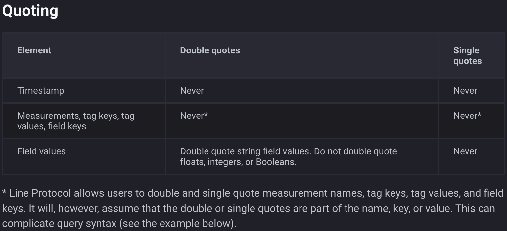
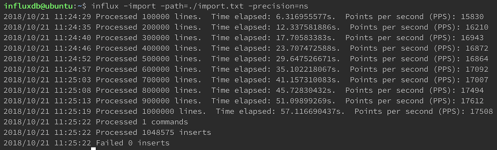

# nc-csv2influxdb
Convert CSV to Line protocol for InfluxDb

Required: 
- Python 3
- pandas `pip install pandas`


Usage

Generate `import.txt` file:

```
python csv2line.py -d <dbname> -i <inputfile> -o <outputfile>

ex:
python csv2line.py -d retail1 -i data.csv -o import.txt
```

Import to InfluxDB

```
influx -import -path=./import.txt -precision=ns
```

Verify
```
$ influx

> drop database retail1

# Delete measurement and series need set data as initial
> use retail1
> precision rfc3339
> select * from transaction limit 3
> #Delete all series data
> drop series from /.*/
> #Delete all measurement data
> drop measurement transaction
```

---------
## NOTE

### Line protocol
https://docs.influxdata.com/influxdb/v1.6/write_protocols/line_protocol_tutorial/
```
weather,location=us-midwest temperature=82 1465839830100400200
  |    -------------------- --------------  |
  |             |             |             |
  |             |             |             |
+-----------+--------+-+---------+-+---------+
|measurement|,tag_set| |field_set| |timestamp|
+-----------+--------+-+---------+-+---------+
```

With tag_set value doesn't have double quote ("), but with field_set value must have double quote for string.

Ex:
```
weather,location=us-midwest temp_str="too hot",out=false 1465839830100400201
```



---------
## EVALUATION

VMware
- 20GB SSD
- 4 processor cores
- 4096 MB RAM

Input data.csv (65.3MB - 1048582 rows - 10 cols)

Convert to Line protocol: import.txt (159.4MB) take 300 seconds

Import to InfluxDB take 53 seconds



### EXAMPLE QUERY: 
```
SELECT mean("price") AS "Price" FROM "retail1"."autogen"."transaction" WHERE time > :dashboardTime: GROUP BY time(:interval:), "brand" FILL(null)
```


